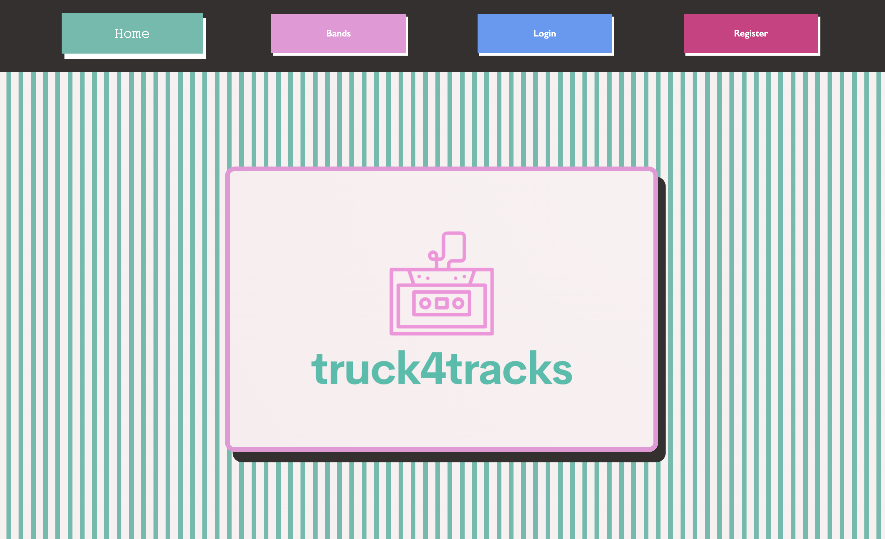
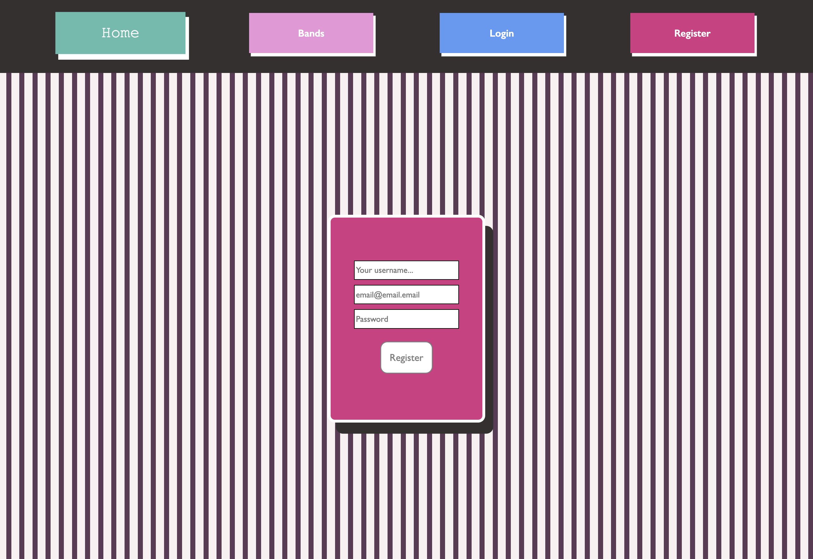
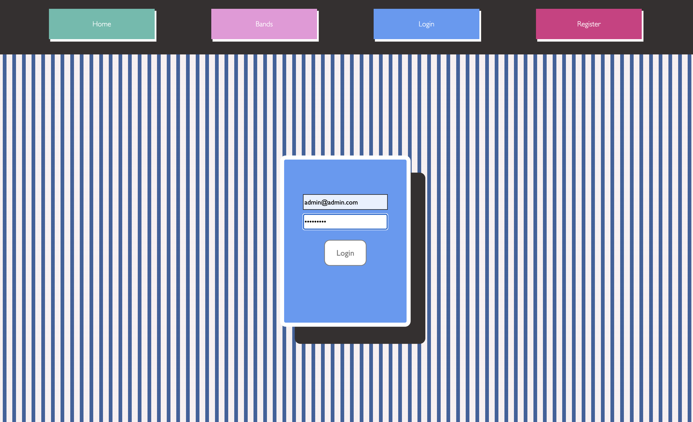
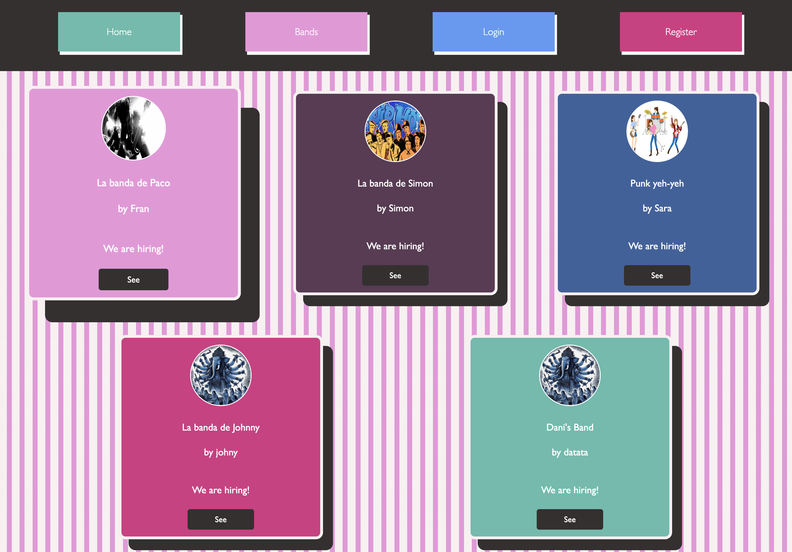
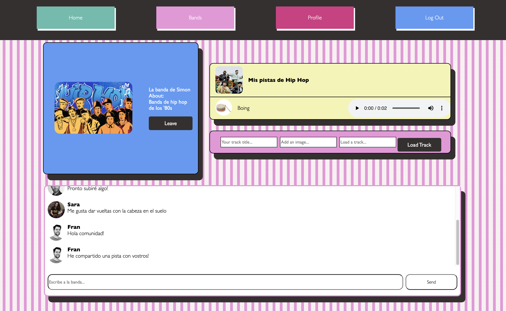
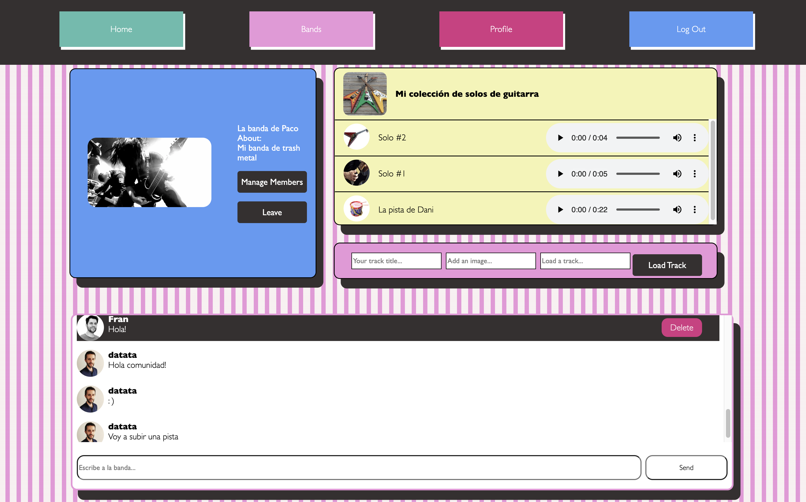
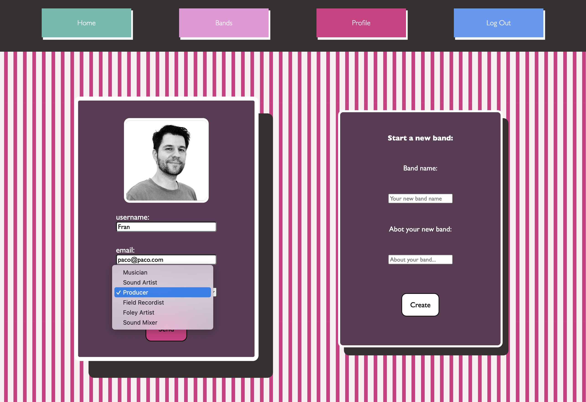
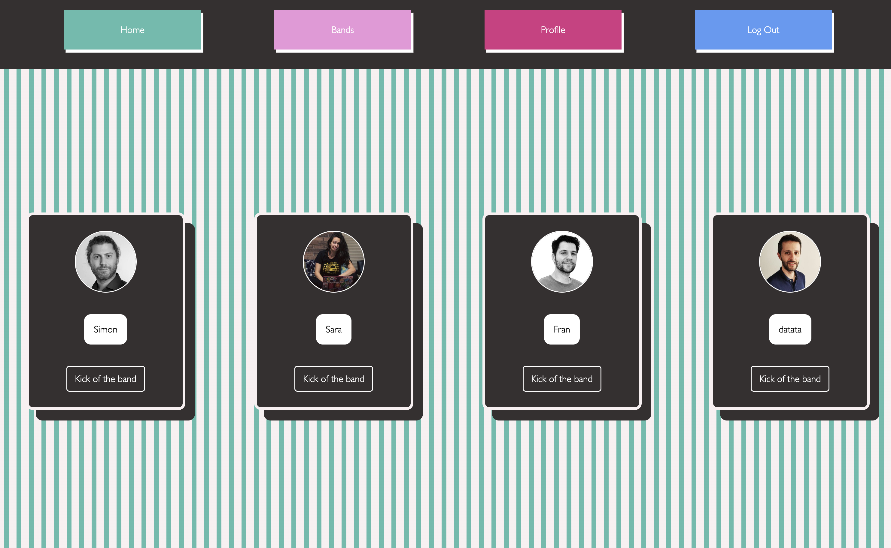
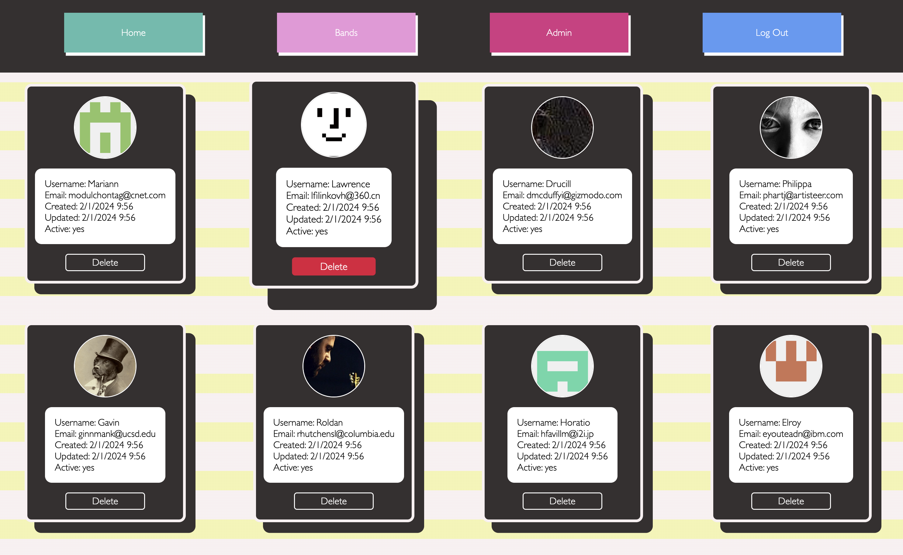

# truck4tracks
#### by Paco Fuentes


---

<details>
  <summary>Content 📝</summary>
  <ol>
    <li><a href="#objetivo-🎯">Objetivo</a></li>
    <li><a href="#sobre-el-proyecto-🔎">Sobre el proyecto</a></li>
    <li><a href="#deploy-🚀">Deploy</a></li>
    <li><a href="#stack">Stack</a></li>
    <li><a href="#install">Install</a></li>
    <li><a href="#views">Views</a></li>
    <li><a href="#what's next?">What's next?</a></li>
    <li><a href="#contribuciones">Contribuciones</a></li>
    <li><a href="#licencia">Licencia</a></li>
    <li><a href="#contacto">Contacto</a></li>
  </ol>
</details>

---

## Objetive 🎯

The purpose of this project is to carry out a comprehensive implementation using fullstack development technologies, contributing to this repository with the front-end section and deploying it on AWS. JavaScript with React and Redux has been employed, in addition to CSS for design.

This is an MVP of a social network with an interface entirely based on a system of cards of different sizes. The platform is designed to create a community of people interested in sharing audio tracks hosted on other services.

'Bands' are created, groups where the user with the role of 'band leader' creates a 'multitrack', a playlist, and proposes a theme. Other users can join and collaborate by uploading their own tracks, and when the 'band leader' deems it appropriate, a 'song', a collaborative audio track, is published as a result.

---

## About the Project 🔎
Front-end MVP for a Social Platform, emphasizing sound sharing and fostering collaborative composition creation among users. This project represents the culmination of the GeeksHubs Academy fullstack developer bootcamp.

---

## Stacks
<div align="center">
    <a href="https://www.reactjs.com/">
        
    </a>
    <a href="https://developer.mozilla.org/es/docs/Web/JavaScript">
        
    </a>
    <a href="https://aws.amazon.com/">
        
    </a>
    <a href="https://redux.js.org/">
        
    </a>
    <a href="https://developer.mozilla.org/en-US/docs/Web/HTML">
        
    </a>
    <a href="https://developer.mozilla.org/en-US/docs/Web/CSS">
        
    </a>
    <a href="https://git-scm.com/">
        
    </a>
    <a href="https://jwt.io/">
        
    </a>
</div>


 ---

## Deploy 🚀
<div align="center">
    <a href="https://despliegue.dkttbnrz8nnws.amplifyapp.com/"><strong>URL to AWS test deploy</strong></a>🚀🚀🚀
</div>

---

## Install

This is frontend app of a previously finished backend project on:

https://github.com/paco-fuentes/API-truck-4-tracks 

Download and follow install intructions. You can populate your database with included sql insert files.

Then clone this repository.

Open terminal on project folder:

1. Clone this repo
```bash
      git clone url
```
2. Install dependencies

```bash
      npm i
```

3. Run this project in dev mode: 

```bash
      npm run dev
```

4. Press 'o' and ENTER on the terminal window to open localhost: on your browser.

---

 ## Views

 ### Guest:

 /home : main view

 <a  href="">
    
</a>

 /register : user register view

 <a href="">
    
</a>

/ login : login registered users and admin

<a href="">
    
</a>

/register and login overview

 <a href="">
    
</a>

/bands : select band view

<a href="">
    
</a>

/band/id : select band view (detail)

<a href="">
    
</a>

/band/id : select band view (detail)

<a href="">
    
</a>


### User

 / main : user overview

 <a href="">
    
</a>

/profile : profile view (detail)

<a href="">
    
</a>

/profile : edit profile and create a new band

<a href="">
    
</a>

/bandmembers : manage band

<a href="">
    
</a>

/band : chat

<a href="">
    
</a>

/band : sharing a track with your band

<a href="">
    
</a>

### Admin

/admin : get all users and delete selected user

<a href="">
    
</a>

/admin : overview

<a href="">
    
</a>

---

## What's next?

In the future, users will have the ability to search for each other based on styles, skills, and instruments, as well as to publish articles for reading and proposals from staff, collaborators, and sponsors.

Next additions:

- Redux
- Tailwind

---

## License

This project is under an MIT license.

---

## Contact

Paco Fuentes. 2023

<a href = "mailto:pacofuentes.work@gmail.com"></a>
<a href="https://www.linkedin.com/in/paco-fuentes-805a40290/" target="_blank"></a> 
</p>


